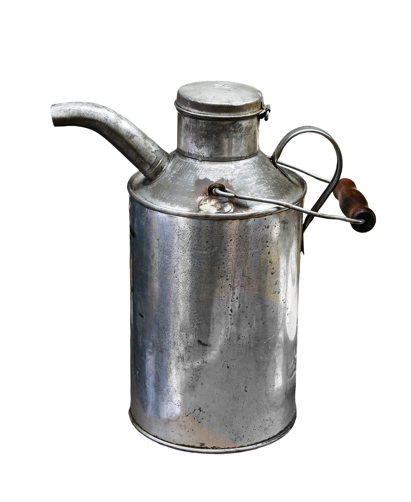

# CSS Can Hover Animation 🎨🛢️

This project demonstrates a creative **hover animation effect** using pure CSS. It simulates the visual appearance of a **can** (like a soda can) with a **design overlay** that shifts when hovered. No JavaScript is used — it's a neat way to explore modern CSS features like `mask-image`, `aspect-ratio`, and CSS variables.

---

## ✨ Features

- Pure CSS-based animated can
- Hover effect with smooth rotation and background shift
- Utilizes `mask-image` and `background-blend-mode` for visual styling
- Clean and responsive aspect ratio using `aspect-ratio`

---

## 📁 Project Structure

📁 project-root/
├── index.html
├── style.css
├── design.png # Overlay design for can
└── can.png # Base can shape used as a mask

---

## 🔧 How It Works

### CSS Breakdown

```css
.can {
    position: absolute;
    left: 100px;
    top: 50px;
    width: 180px;
    aspect-ratio: 2 / 3.25;

    /* Transition effect */
    transition: .5s ease-in-out;

    /* Custom CSS variable for background position */
    --left: -210px;

    /* Background with layered images */
    background: url(design.png) var(--left) 0, url(can.png);
    background-size: cover;
    background-blend-mode: multiply;

    /* Masking to shape the div as a can */
    mask-image: url(can.png);
    mask-size: cover;
}

```

## On Hover

```css
.can:hover {
    top: 40px;        /* Moves slightly upward */
    rotate: 10deg;    /* Slight rotation for effect */
    --left: 0px;      /* Shift the design image into view */
}

```
## 🚀 How to Use

1. Clone this repo or copy the code files.
2. Ensure you have `design.png` and `can.png` in the same folder as your HTML and CSS files.
3. Open `index.html` in your browser.
4. Hover over the can to see the animation in action!

---

## 📸 Preview

*(Insert a screenshot or GIF of the animation here)*



---

## 📚 Learnings & Concepts

- CSS Variables (`--left`)
- `mask-image` for shaping elements
- `background-blend-mode` for layering styles
- Smooth transitions using `transition`
- CSS hover states and transformations

---

## 🛠️ Browser Support

- ✅ Chrome  
- ✅ Firefox  
- ✅ Edge  
- ⚠️ Safari (ensure support for `mask-image`)

---

## 📃 License

This project is open source under the [MIT License](LICENSE).

---

## 🙌 Credits

- Design inspired by CSS creative UI demos.
- Images used: `can.png` and `design.png` should be custom or royalty-free.

---

## 💡 Want to Contribute?

Feel free to fork this repo, add improvements, or even make the can spin or animate further! Pull requests are welcome.
